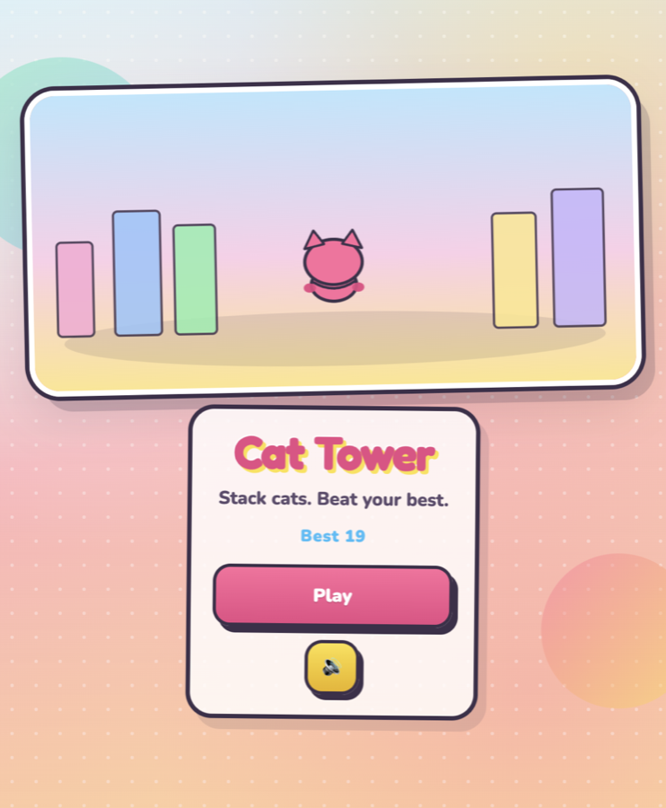
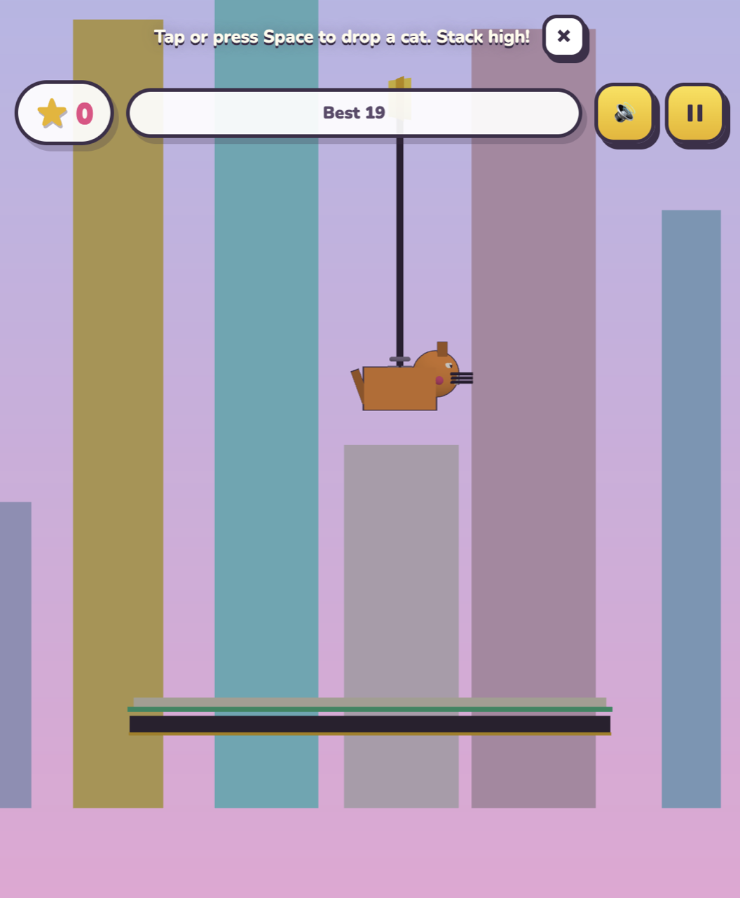

# Cat Tower

A browser stacking game: swing the crane, drop colorful cats, and build the tallest tower you can—without toppling the stack.



## Play

```bash
npm install
npm run dev
```

Open the URL Vite prints (usually [http://localhost:5173](http://localhost:5173)). Tap or press **Space** to drop a cat. **Escape** pauses.

```bash
npm run build   # production bundle → dist/
npm run preview # serve dist locally
```

## Gameplay



- **Scoring**: Landings add points; staying centered on the stack builds a combo.
- **Rules**: Each new cat must sit **meaningfully higher** than the current tower—side-by-side piles at the same height end the run.
- **Audio**: Mute from the main menu or the in-game button.

## Stack

- [Vite](https://vitejs.dev/) + TypeScript
- [Three.js](https://threejs.org/) for rendering
- [Rapier 2D](https://rapier.rs/) (WASM) for physics

## License

Private / all rights reserved unless you add an explicit license.
